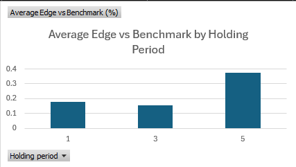
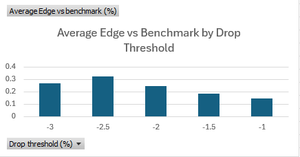
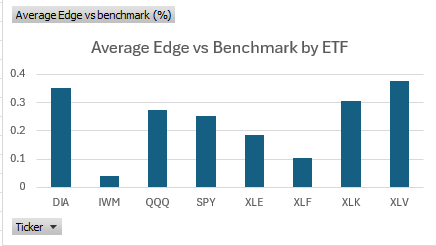
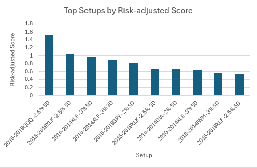
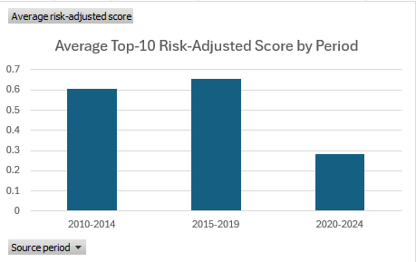
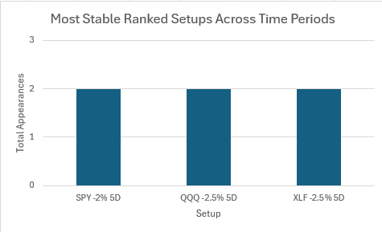
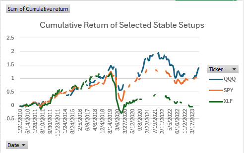
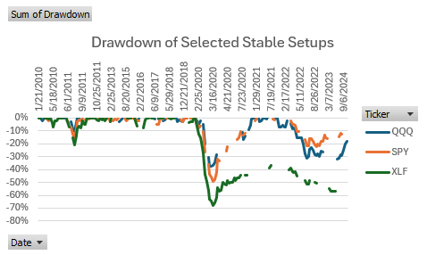

# Market Drop Rebound Analyzer

## Overview

This project analyzes whether major ETF selloffs are followed by short-term rebounds.

The main research question is:

**After an ETF drops by a certain percentage in one day, does it tend to rebound over the next 1, 3, or 5 trading days?**

I started this project because I wanted to build something more meaningful than just downloading stock data and calculating basic returns. My goal was to create a small research/backtesting pipeline that could test a real market behavior, compare results across multiple ETFs, and organize the results in a way that supports an actual conclusion.

This project should be viewed as a **rules-based market research and backtesting pipeline**, not a finished trading strategy. The goal was not only to find the best-looking setup, but also to test whether the results were stable, realistic after costs, and strong enough to survive stricter validation.

The full raw `results/` folder is not included in this repository because it contains many generated event-level CSV files. These files can be regenerated by running:

```bash
python src/main.py
```

The repository includes the main code, cleaned/filtered result files, chart images, requirements file, and project documentation.

---

## Research Question

The main question I wanted to test was:

**Do large one-day ETF drops create a short-term rebound opportunity?**

More specifically, I tested:

* What happens after an ETF drops by at least 1.0%, 1.5%, 2.0%, 2.5%, or 3.0% in one day?
* What is the average return after holding for 1, 3, or 5 trading days?
* How often is the return positive after those drops?
* How does the return after a big drop compare to the ETF’s normal return over the same holding period?
* Which ticker, threshold, and holding-period combinations show the strongest raw edge?
* Which setups still look strong after accounting for downside risk?
* Are the strongest setups stable across different market periods?
* Do the results survive transaction-cost assumptions?
* What do the cumulative return and drawdown paths look like for selected setups?
* Do selected setups look statistically stronger when tested with bootstrap confidence intervals?
* Do setups selected from earlier data still work out-of-sample?

---

## ETFs Analyzed

The current version analyzes eight ETFs:

```text
SPY - S&P 500 ETF
QQQ - Nasdaq 100 ETF
IWM - Russell 2000 ETF
DIA - Dow Jones Industrial Average ETF
XLK - Technology sector ETF
XLF - Financial sector ETF
XLE - Energy sector ETF
XLV - Healthcare sector ETF
```

I chose ETFs instead of individual stocks because ETFs are broader and less dependent on single-company news. This makes the project more about market and sector behavior instead of one company having a unique event.

---

## Time Period

The full-sample analysis uses historical market data from:

```text
2010-01-01 to 2025-01-01
```

I also split the data into separate market periods:

```text
2010-2014
2015-2019
2020-2024
```

The purpose of this split was to test whether the top-ranked setups were stable across time or whether they only looked strong because of one specific market environment.

---

## Tools and Libraries

This project uses:

```text
Python
pandas
numpy
yfinance
CSV output files
Excel for manual filtering, pivot tables, and chart creation
```

I used `yfinance` to download historical ETF data, and I used `pandas` and `numpy` to calculate returns, filter big-drop days, calculate metrics, rank setups, and export results.

---

## Code Organization

The project originally started as one large Python script. I refactored it into a multi-file structure so the code would be easier to understand, maintain, and expand.

The refactor was meant to reorganize the code, not change the research logic or conclusions. I verified the refactor by comparing output files from the original single-file version and the refactored version.

Current structure:

```text
src/
  main.py
  config.py
  analysis.py
  ranking.py
  transaction_costs.py
  drawdown.py
  bootstrap.py
  out_of_sample.py
```

Each file has a specific role:

```text
main.py
Controls the full project execution order.

config.py
Stores tickers, thresholds, holding periods, periods, transaction costs, and selected setups.

analysis.py
Handles return calculations and ticker/threshold analysis.

ranking.py
Filters and ranks setups using edge, win rate, sample size, and risk-adjusted score.

transaction_costs.py
Applies transaction costs to individual trade returns and recalculates metrics.

drawdown.py
Calculates cumulative return, running peak, and drawdown for selected setups.

bootstrap.py
Calculates bootstrap confidence intervals for selected setup average returns.

out_of_sample.py
Tests whether setups selected from 2010-2019 still worked in 2020-2024.
```

---

## How the Project Works

The project follows this general process:

1. Load project settings from `config.py`.
2. Download historical ETF price data.
3. Calculate daily returns.
4. Calculate future returns for 1-day, 3-day, and 5-day holding periods.
5. Identify big-drop days based on each threshold.
6. Calculate performance metrics after those drops.
7. Compare those returns to benchmark average returns.
8. Calculate edge vs benchmark.
9. Calculate a simple risk-adjusted score.
10. Save event-level and summary CSV files.
11. Create long-format summary files for filtering and ranking.
12. Rank setups using sample size, edge, win rate, and risk-adjusted score.
13. Repeat the analysis across separate market periods.
14. Apply transaction-cost assumptions.
15. Compare setup survival under different cost levels.
16. Analyze cumulative return and drawdown for selected repeated setups.
17. Run bootstrap confidence intervals for selected setups.
18. Run out-of-sample validation using 2010-2019 as training data and 2020-2024 as test data.

---

## Main Calculations

### Daily Return

The first important calculation is the ETF’s daily return:

```python
data["Daily_Return"] = data["Close"].pct_change()
```

This calculates the percentage change from one closing price to the next. It is what allows the program to identify days where an ETF dropped by a certain amount.

For example, if SPY dropped by 2.3% in one day, then that day would qualify under the `-2.0%` threshold because the daily return is less than or equal to `-0.02`.

---

### Future Return

The project then calculates future returns for different holding periods:

```text
1 trading day
3 trading days
5 trading days
```

The idea is to ask:

**If I bought at the close of a big-drop day, what would my return be after 1, 3, or 5 trading days?**

Conceptually:

```text
Future return = future close / current close - 1
```

---

### Drop Thresholds

The project tests multiple definitions of a big drop:

```text
-1.0%
-1.5%
-2.0%
-2.5%
-3.0%
```

This matters because a 1% drop and a 3% drop are not the same type of event. A 1% drop happens more often, but it may not create a strong rebound. A 3% drop happens less often, but it may either create a stronger rebound or signal a more dangerous market environment.

Testing multiple thresholds lets the project answer a better question:

**Do larger drops lead to stronger rebounds, or do they just create more risk?**

---

## Metrics Calculated

For each ticker, threshold, and holding period, the project calculates:

```text
Number of big drop days
Average return
Benchmark average return
Edge vs benchmark
Win rate
Best return
Worst return
Average winning trade
Average losing trade
Risk-adjusted score
```

### Number of Big Drop Days

This is the number of times the ETF dropped by at least the selected threshold.

This matters because a setup with very few events may not be reliable. A setup with a small sample size could look strong mostly because of randomness.

---

### Average Return

This is the average return after a big-drop day for a given holding period.

For example:

```text
Average 5-day return after a -2.0% drop
```

This shows what happened after the specific condition being tested.

---

### Benchmark Average Return

This is the ETF’s normal average future return over the same holding period, using all days instead of only big-drop days.

This matters because an average return after a big drop does not mean much by itself. If SPY returns 0.78% after a big drop, I need to know whether that is actually better than SPY’s normal 5-day return.

---

### Edge vs Benchmark

This is the difference between the big-drop return and the normal benchmark return.

Conceptually:

```text
Edge = average return after big drop - benchmark average return
```

A positive edge means the big-drop setup performed better than normal. A negative edge means the setup performed worse than normal. An edge near zero means the setup was probably not very special.

This became one of the most important metrics in the project because it tells me whether the big-drop condition actually added value.

---

### Win Rate

This is the percentage of big-drop events where the future return was positive.

For example, a 60% win rate means that 60% of the time, the ETF was positive after the selected holding period.

Win rate matters because average return alone can be misleading. A setup could have a high average return because of a few huge winners, even if it loses often.

---

### Best and Worst Return

The best return shows the strongest future return after a big drop.

The worst return shows the largest loss after a big drop.

This matters because a setup can have a positive average return but still have large downside risk.

---

### Average Winning and Losing Trade

Average winning trade measures the average return among only positive-return events.

Average losing trade measures the average return among only negative-return events.

This matters because win rate by itself is not enough. A setup could win often but lose too much when it loses.

---

### Risk-Adjusted Score

After comparing setups by raw edge, I added a simple risk-adjusted score:

```text
Risk-adjusted score = edge vs benchmark / abs(average losing trade)
```

This is not meant to be a professional risk metric. It is a simple way to compare how much extra return a setup produced relative to the size of its average loss.

This helped because sorting only by edge favored some high-volatility setups. For example, XLE had some strong raw edges, but it also had large downside. The risk-adjusted score helped separate high-rebound setups from cleaner setups with more reasonable losses.

---

## Validation Steps Added

Version 1 includes several validation steps beyond the basic full-period analysis.

### 1. Full-Period Analysis

The first step tested all tickers, thresholds, and holding periods across the full 2010-2024 period.

This showed the strongest raw edges and helped identify the general pattern that 5-day holding periods after larger drops tended to produce the strongest rebound results.

---

### 2. Period-by-Period Testing

I split the data into:

```text
2010-2014
2015-2019
2020-2024
```

This tested whether the strongest setups were stable across different market environments.

The results showed that the best setups were not identical across periods. The 2015-2019 period looked strongest, while the 2020-2024 period looked weaker and more fragile.

---

### 3. Stability Comparison

After ranking setups within each period, I compared the top 10 setups from each period.

No setup appeared in the top 10 across all three periods.

Three setups appeared in the top 10 in two out of three periods:

```text
SPY | -2.0% threshold | 5-day hold
QQQ | -2.5% threshold | 5-day hold
XLF | -2.5% threshold | 5-day hold
```

This was an important result because it showed that the rebound effect existed historically, but the strongest setups were not perfectly stable across all regimes.

---

### 4. Transaction-Cost Sensitivity

I tested several transaction-cost assumptions:

```text
0.00%
0.10%
0.25%
0.50%
```

For each cost level, the project adjusted individual trade returns first and then recalculated the metrics.

This matters because transaction costs do not only reduce average return. They can also turn small winners into losers, reduce win rate, and change the average winning and losing trade.

The results showed that the number of surviving setups declined as costs increased. The 2020-2024 period was especially sensitive to transaction costs.

---

### 5. Selected Setup Drawdown Analysis

After the stability and transaction-cost analysis, I selected repeated setups for deeper path analysis:

```text
SPY | -2.0% threshold | 5-day hold
QQQ | -2.5% threshold | 5-day hold
XLF | -2.5% threshold | 5-day hold
```

For these setups, I calculated:

```text
Cumulative return
Running peak
Drawdown
Maximum drawdown
Final cumulative return
```

This helped move the analysis beyond summary statistics. A setup can have a positive average return but still have a painful or unrealistic return path.

The drawdown analysis showed that QQQ -2.5% 5D had the strongest selected setup path. SPY -2.0% 5D was also positive but had deeper drawdown. XLF -2.5% 5D looked much weaker after path and drawdown analysis.

---

### 6. Bootstrap Confidence Intervals

I added a bootstrap confidence interval test for the selected setups.

The goal was to check whether the average after-cost trade return looked statistically reliable or whether it could plausibly be random noise.

Conceptually:

```text
Repeatedly resample trade returns
Calculate the average return for each sample
Use the simulated averages to estimate a 95% confidence interval
```

The bootstrap results showed that QQQ -2.5% 5D was the strongest statistically among the selected setups. Its confidence interval stayed slightly positive, while SPY and XLF had intervals that crossed zero.

---

### 7. Out-of-Sample Validation

Finally, I added an out-of-sample test.

The setup was:

```text
Training period: 2010-2019
Test period: 2020-2024
```

The top 10 setups were selected using only the training period. Then those exact setups were tested on the later test period.

None of the top 10 training setups passed the out-of-sample rule in 2020-2024.

The passing rule required:

```text
Positive test-period edge
Test-period win rate of at least 55%
```

XLV -2.5% 5D had the best test-period edge, but its win rate was below the passing threshold.

This suggests that the rebound effect was historically present, but not stable enough to treat as a finished trading strategy.

---

## Key Findings

The strongest raw edges mostly appeared in 5-day holding periods after 2% to 3% drops.

Average edge was strongest around the -2.5% drop threshold.

The best-looking ETFs by average edge included:

```text
XLV
DIA
XLK
```

However, risk-adjusted ranking changed the interpretation. Some high-edge setups also had large downside, especially in more volatile ETFs such as XLE.

The results were regime-dependent:

```text
2015-2019 looked strongest.
2020-2024 looked weaker and more fragile.
```

The stability comparison found no setup that appeared in the top 10 across all three periods.

The three most repeated setups were:

```text
SPY | -2.0% | 5-day
QQQ | -2.5% | 5-day
XLF | -2.5% | 5-day
```

After drawdown and bootstrap testing, QQQ -2.5% 5D was the strongest selected setup.

The out-of-sample test showed that the strongest training-period setups did not pass the validation rule in 2020-2024.

The final conclusion is that the drop-rebound effect was real historically, but it was regime-dependent and not stable enough to call a finished trading strategy.

---

## Results and Visualizations

The project includes chart images summarizing the main findings.

### Average Edge by Holding Period



The average edge vs benchmark was highest for the 5-day holding period. This supports one of the main findings of the project: the rebound effect was stronger over several trading days than immediately the next day.

---

### Average Edge by Drop Threshold



The average edge was strongest around the -2.5% threshold. This suggests that larger one-day drops generally created stronger rebound opportunities than smaller drops, but the relationship was not perfectly linear.

---

### Average Edge by ETF



The ETFs with the strongest average edge were XLV, DIA, and XLK. This showed that the rebound effect was not equally strong across all ETFs.

---

### Top Setups by Risk-Adjusted Score



The strongest individual setups by risk-adjusted score were mostly concentrated in earlier periods, especially 2010-2014 and 2015-2019.

---

### Average Top-10 Risk-Adjusted Score by Period



The 2015-2019 period had the strongest average top-10 risk-adjusted score. The 2020-2024 period was much weaker, which supports the idea that the rebound effect depended heavily on market regime.

---

### Most Stable Ranked Setups



No setup appeared in the top 10 across all three periods. The most stable setups appeared in two out of three periods.

---

### Transaction Cost Sensitivity


The number of surviving setups declined as transaction costs increased. The 2020-2024 period was much more fragile than the earlier periods.

---

### Selected Setup Cumulative Return



QQQ -2.5% 5D had the strongest cumulative return path among the selected repeated setups.

---

### Selected Setup Drawdown



The drawdown chart showed that QQQ had the strongest selected path, SPY had positive performance with deeper drawdown, and XLF had the weakest path.

---

### Bootstrap Confidence Intervals


QQQ -2.5% 5D was the only selected setup whose bootstrap confidence interval stayed above zero.

---

## Files Created

The project creates several types of output files.

### Event-Level Files

These contain the actual big-drop dates for each ticker, threshold, and period, along with future return columns.

Example:

```text
SPY_2p0_big_drop_days2010-2014.csv
QQQ_2p5_big_drop_days2015-2019.csv
XLE_3p0_big_drop_days2020-2024.csv
```

These files are useful because they allow inspection of the actual events behind the summary statistics.

---

### Summary Files

These summarize the metrics for each ticker, threshold, and holding period.

Example:

```text
SPY_2p0_summary2010-2014.csv
QQQ_2p5_summary2015-2019.csv
```

---

### Combined Summary Files

These combine results across tickers and thresholds.

Example:

```text
combined_summary_2010-2014.csv
combined_summary_2015-2019.csv
combined_summary_2020-2024.csv
```

---

### Long-Format Summary Files

These are the most useful files for ranking and filtering.

Each row represents:

```text
One period
One ticker
One drop threshold
One holding period
```

This format makes it easier to sort, filter, rank, and compare setups directly.

---

### Ranked Setup Files

The ranked setup files apply rules such as:

```text
Minimum number of big-drop days
Edge vs benchmark > 0
Win rate >= 55%
Sort by risk-adjusted score
```

These files turn the project from raw data output into a system that can automatically identify the best-looking setups under defined rules.

---

### Transaction-Cost Files

These files show which setups survive under different transaction-cost assumptions.

Example:

```text
ranked_after_cost_sensitivity_2010-2014.csv
ranked_after_cost_sensitivity_2015-2019.csv
ranked_after_cost_sensitivity_2020-2024.csv
transaction_cost_survival_summary.csv
```

---

### Drawdown Files

These files analyze selected repeated setups over time.

Example:

```text
selected_setup_drawdowns.csv
selected_setup_drawdown_summary.csv
```

They include cumulative return, running peak, and drawdown for selected setups.

---

### Bootstrap Files

These files summarize the bootstrap confidence interval results for selected setups.

Example:

```text
selected_setup_bootstrap_summary.csv
```

---

### Stability Comparison Files

These files compare whether the same setups appeared repeatedly in top-ranked results across periods.

Example:

```text
stability_top10_comparison.csv
top10_by_period_combined.csv
```

---

## What I Learned

This project helped me understand several programming, data analysis, and research concepts.

### Python and Project Structure

I learned how to move from one large script into a cleaner multi-file project. Splitting the code into files like `analysis.py`, `ranking.py`, and `drawdown.py` made the project easier to understand and expand.

---

### pandas and DataFrames

I learned how to use pandas for filtering, calculating returns, creating new columns, exporting CSV files, and organizing summary metrics.

---

### Dictionaries

Earlier in the project, I was storing results in separate variables. That became messy as the number of metrics grew.

I refactored the project to use nested dictionaries, where each holding period stores its own metrics. This made the code cleaner and helped me understand how dictionaries can store labeled data more clearly than lists.

---

### Backtesting Logic

I learned that a backtest is not just about finding a high average return. It also needs benchmark comparison, risk analysis, sample-size filters, transaction costs, drawdowns, and out-of-sample testing.

---

### Research Interpretation

The most important thing I learned is that a result can look strong in the full sample but become weaker after stricter validation.

The project became more realistic after I added:

```text
Period testing
Stability comparison
Transaction-cost sensitivity
Drawdown analysis
Bootstrap confidence intervals
Out-of-sample validation
```

These steps showed that the rebound effect existed historically, but it was not stable enough to treat as a finished trading strategy.

---

## Limitations

This project has several limitations.

The analysis only uses historical ETF data. It does not include macroeconomic variables, volatility indexes, market breadth, interest rates, or news.

The strategy rules are simple and based only on one-day drop thresholds.

The transaction-cost model is basic and does not include slippage, liquidity constraints, bid-ask spread changes, or position sizing.

The bootstrap test helps estimate uncertainty, but it does not prove that a setup will continue working in the future.

The out-of-sample test showed that the strongest training-period setups did not pass the validation rule in 2020-2024.

Because of these limitations, this project should not be viewed as a complete trading system. It is a market research pipeline that tests whether a historical rebound effect exists and how stable that effect is under stricter validation.

---

## Current Conclusion

Version 1 found historical rebound behavior after large ETF selloffs, especially over 5-day holding periods and around the -2.5% threshold.

However, the stricter validation steps changed the interpretation.

The strongest raw setups were not always the best after accounting for downside risk. The best setups changed across market periods. Transaction costs weakened the results. Drawdown analysis showed that some repeated setups had poor return paths. Bootstrap confidence intervals showed that only QQQ -2.5% 5D was statistically stronger among the selected setups. The out-of-sample test showed that the best training-period setups did not pass the validation rule in 2020-2024.

The final conclusion is:

**The drop-rebound effect was historically present, but it was regime-dependent and not stable enough to treat as a finished trading strategy.**

This makes Version 1 a completed rules-based research/backtesting project, while still leaving room for future extensions.

---

## Possible Future Extensions

### Broader ETF Robustness Test

One possible next step is to test a broader ETF universe, including more sector, industry, bond, commodity, and thematic ETFs.

Possible additions:

```text
XLI
XLY
XLP
XLU
XLB
XLRE
SMH
SOXX
IGV
TLT
HYG
LQD
GLD
SLV
USO
```

The goal would be to keep the same methodology and test whether the framework finds stronger or more stable setups in a broader universe.

---

### Machine Learning Extension

Another possible extension is to add a machine learning phase inside the same repository.

The motivation would be that the rules-based setup was not stable enough out-of-sample, so ML could test whether event-level features can better identify which big-drop days are more likely to rebound.

Possible folder structure:

```text
ml/
  feature_engineering.py
  train_model.py
  evaluate_model.py
```

Possible features:

```text
Previous 5-day return
Previous 10-day return
Previous 20-day volatility
Volume change
Distance from moving average
Market regime features
ETF or sector identifier
```

Possible targets:

```text
Whether the 5-day return after the drop was positive
Whether the 5-day return after the drop beat the benchmark
```

The ML extension would need to avoid data leakage and use a proper train/test split.

---

## How to Run

Install the required packages:

```bash
pip install -r requirements.txt
```

Run the project:

```bash
python src/main.py
```

The program will download historical ETF data, run the analysis, and regenerate the output files.

---

## Final Note

This project was built to practice Python, pandas, backtesting logic, research design, and realistic validation. The most important part of the project is not that it found one perfect setup. The most important part is that it tested an idea, found historical evidence, added stricter validation, and reached a more realistic conclusion.
