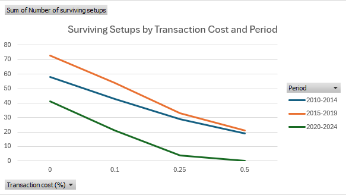
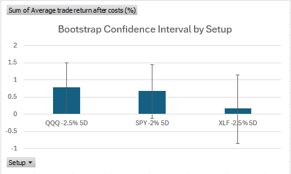

# Market Drop Rebound Analyzer

## Overview

This project analyzes whether major ETF selloffs are followed by short-term rebounds. The main question I wanted to test was:
The full raw `results/` folder is not included in the repository because it contains many generated event-level CSV files. These files can be regenerated by running `python src/main.py`. The repository includes the cleaned/filtered result files and chart images used for the final analysis.

**After an ETF drops by a certain percentage in one day, does it tend to rebound over the next 1, 3, or 5 trading days?**

I started this project because I wanted something more meaningful than just downloading stock data and calculating basic returns. I wanted to build a small research/backtesting system where I could test a real market behavior, compare results across different ETFs, and organize the results in a way that could actually support a conclusion.

The current version analyzes multiple ETFs, multiple drop thresholds, multiple holding periods, multiple market periods, and multiple transaction-cost assumptions. It creates individual event files, individual summary files, wide combined summary files, long-format summary files, ranked setup files, stability comparison files, transaction-cost sensitivity files, selected setup drawdown files, bootstrap confidence interval files, out-of-sample testing, and chart images. The project now also includes benchmark comparison, edge vs benchmark, risk-adjusted scoring, time-period testing, stability testing, transaction-cost sensitivity, selected setup drawdown analysis, and bootstrap confidence intervals to see whether the strongest setups are stable, realistic after costs, usable over time, and statistically more convincing than random noise.

## Research Question

The main research question is:

**Do large one-day drops create a short-term rebound opportunity?**

More specifically, I tested:

* What happens after an ETF drops by at least 1.0%, 1.5%, 2.0%, 2.5%, or 3.0% in one day?
* What is the average return after holding for 1, 3, or 5 trading days?
* How often is the return positive after those drops?
* How does the return after a big drop compare to the ETF’s normal average return over the same holding period?
* Which ticker, drop threshold, and holding period combinations show the strongest raw edge?
* Which setups still look strong after accounting for average downside?
* Are the strongest setups stable across different time periods, or do they depend on the market regime?
* Do the ranked setups survive after adding basic transaction-cost assumptions?
* What does the return path look like for selected stable setups?
* Which selected setup has the best cumulative return without the worst drawdown?
* Do the selected setups still look reliable when their average trade returns are tested with a bootstrap confidence interval?

## ETFs Analyzed

The project currently analyzes the following ETFs:

```text
SPY  - S&P 500 ETF
QQQ  - Nasdaq 100 ETF
IWM  - Russell 2000 ETF
DIA  - Dow Jones Industrial Average ETF
XLK  - Technology sector ETF
XLF  - Financial sector ETF
XLE  - Energy sector ETF
XLV  - Healthcare sector ETF
```

I chose ETFs instead of individual stocks because ETFs are broader and less dependent on single-company news. This makes the project more about market or sector behavior instead of one company having a unique event.

## Time Period

The full-sample analysis uses historical market data from:

```text
2010-01-01 to 2025-01-01
```

This gives the analysis a large enough time window to include different market environments, including long bull markets, selloffs, sector rotations, and major volatility periods.

I also split the data into separate market periods:

```text
2010-2014
2015-2019
2020-2024
```

The purpose of this was to test whether the top-ranked setups are stable across time or whether they only look strong because of one specific market environment.

## Tools and Libraries Used

The project uses:

```text
Python
pandas
yfinance
CSV output files
Excel for manual filtering, pivot tables, ranking, and chart creation
```

I used `yfinance` to download historical market data and `pandas` to calculate returns, filter big-drop days, store metrics, rank setups, and export results to CSV files.

## Code Organization

The project originally worked as one large Python script. I refactored it into smaller files so the code is easier to understand, maintain, and expand.

The refactor was only meant to reorganize the code. It was not meant to change the research logic, formulas, or conclusions. I verified the refactor by comparing output CSV files from the original single-file version and the refactored multi-file version.

The current code is organized like this:

```text
src/
  main.py
  config.py
  analysis.py
  ranking.py
  transaction_costs.py
  drawdown.py
  bootstrap.py
```

Each file has a specific job:

```text
main.py - controls the overall project order
config.py - stores tickers, thresholds, holding periods, periods, transaction costs, and selected setups
analysis.py - handles return calculations and ticker/threshold analysis
ranking.py - handles filtering and ranking rules
transaction_costs.py - recalculates metrics after applying transaction costs to individual trade returns
drawdown.py - analyzes cumulative return and drawdown paths for selected setups
bootstrap.py - creates bootstrap confidence intervals for selected setup average returns
out-of-sample.py - runs an out of sample test for selected ETF's and time intervals
```

## How the Project Works

The project follows this general process:

1. Load the project settings.
2. Download historical ETF price data.
3. Calculate the ETF’s daily return.
4. Calculate future returns for different holding periods.
5. Identify “big drop days” based on a drop threshold.
6. Calculate performance metrics after those big drops.
7. Compare those returns to normal benchmark returns.
8. Calculate edge vs benchmark and a risk-adjusted score.
9. Save detailed event-level data.
10. Save individual summary files.
11. Save combined wide-format summary files.
12. Save long-format summary files for ranking and filtering.
13. Filter and rank setups automatically.
14. Repeat the analysis across separate time periods.
15. Apply transaction-cost assumptions to individual trade returns and recalculate after-cost metrics.
16. Compare how many setups survive as transaction costs increase.
17. Select repeated setups for deeper drawdown analysis.
18. Calculate cumulative return and drawdown for those selected setups.
19. Compare final cumulative return, maximum drawdown, and trade path quality.
20. Run a bootstrap confidence interval test on selected setup returns.
21. Run an out-of-sample test on selected setups and time intervals.
22. Save the output files.

## Daily Return Calculation

The first important calculation is the daily return:

```python
data["Daily_Return"] = data["Close"].pct_change()
```

This calculates the percentage change from one closing price to the next. This is what lets the program identify days where an ETF dropped by a certain amount.

For example, if SPY dropped by 2.3% in one day, then that day would qualify under the `-2.0%` threshold because the daily return is less than or equal to `-0.02`.

## Future Return Calculation

The project then calculates future returns for different holding periods:

```text
1-day later return
3-day later return
5-day later return
```

The idea is to ask:

**If I bought at the close of a big-drop day, what would my return be after 1, 3, or 5 trading days?**

The future return is calculated by comparing a future closing price to the current closing price.

Conceptually:

```text
Future return = future close / current close - 1
```

This is done for every holding period in a loop, so the project is not hardcoded to only one holding period.

## Drop Thresholds

Instead of only testing one definition of a big drop, the project tests multiple thresholds:

```text
-1.0%
-1.5%
-2.0%
-2.5%
-3.0%
```

This matters because a 1% drop and a 3% drop are not the same type of event. A 1% drop happens much more often, but it may not create a very strong rebound. A 3% drop happens less often, but it may create a stronger rebound or it may just indicate a more dangerous market environment.

Testing multiple thresholds allows the project to answer a better question:

**Do larger drops lead to stronger rebounds, or do they just create more risk?**

## Holding Periods

The project tests three holding periods:

```text
1 trading day
3 trading days
5 trading days
```

This allows the project to compare immediate rebounds against slightly longer short-term rebounds.

A 1-day holding period checks whether the market tends to bounce right away. A 3-day holding period checks whether the rebound takes a few days. A 5-day holding period checks whether the effect is stronger over about one trading week.

## Why I Used Dictionaries

Earlier in the project, I was storing results in separate variables and separate dictionaries, like average returns, win rates, best returns, worst returns, and so on. That quickly became messy because there were too many manually typed variables.

I refactored the project to use a nested dictionary called `metrics`.

The structure is:

```text
holding period -> metric name -> value
```

For example:

```text
metrics[5]["avg_return"]
```

means:

```text
the average return for the 5-day holding period
```

and:

```text
metrics[3]["win_rate"]
```

means:

```text
the win rate for the 3-day holding period
```

This helped me understand that a dictionary is not just an array. A list stores values by position, but a dictionary stores values by label. That made more sense for this project because I wanted each value to have a clear meaning.

The nested dictionary made the code cleaner because instead of having separate variables for every metric, each holding period stores all of its own metrics in one place.

## Metrics Calculated

For each ticker, threshold, and holding period, the project calculates:

### Number of Big Drop Days

This is the number of times the ETF dropped by at least the selected threshold.

This matters because a setup with only a small number of events may not be reliable. For example, a strategy with 20 events could look very strong by luck. In the full-period analysis, I filtered for at least 100 events. In the shorter 5-year period tests, I used a lower filter because each period has fewer total trading days.

### Average Return

This is the average return after a big-drop day for a given holding period.

For example:

```text
Average 5-day return after a -2.0% drop
```

This tells me what happened after the specific condition I am testing.

### Benchmark Average Return

This is the ETF’s normal average future return over the same holding period, using all days instead of only big-drop days.

This matters because an average return after a big drop does not mean much by itself. If SPY returns 0.78% after a big drop, I need to know whether that is actually better than SPY’s normal 5-day return.

### Edge vs Benchmark

This is the difference between the big-drop return and the normal benchmark return.

Conceptually:

```text
Edge = average return after big drop - normal average return
```

A positive edge means the big-drop setup performed better than normal. A negative edge means the big-drop setup performed worse than normal. An edge near zero means the setup was probably not very special.

This became one of the most important metrics in the project because it tells me whether the condition actually added value.

### Win Rate

This is the percentage of big-drop events where the future return was positive.

For example, a 60% win rate means that 60% of the time, the ETF was positive after the holding period.

This matters because average return alone can be misleading. A setup could have a high average return because of a few huge winners, even if it loses often.

### Best Return

This is the best future return after a big drop for a given ticker, threshold, and holding period.

This shows the upside potential of the setup.

### Worst Return

This is the worst future return after a big drop for a given ticker, threshold, and holding period.

This is important because a strategy can have a positive average return but still have large downside risk. For example, some XLE setups had strong edge but also very large worst-case losses.

### Average Winning Trade

This is the average return among only the positive-return events.

This shows how large the winners usually are.

### Average Losing Trade

This is the average return among only the losing events.

This shows how large the losses usually are.

This matters because win rate by itself is not enough. A setup could win often but lose too much when it loses.

### Risk-Adjusted Score

After comparing setups by raw edge, I added a simple risk-adjusted score:

```text
Risk-adjusted score = edge vs benchmark / absolute value of average losing trade
```

This score is not meant to be a final professional risk metric. It is a simple way to compare how much extra return a setup produced relative to the size of its average loss.

This helped because sorting only by edge favored some high-volatility setups. For example, XLE had some of the highest raw edge values, but it also had very large average losses and worst-case losses. The risk-adjusted score helped separate high-rebound setups from cleaner setups with more reasonable downside.

### Transaction Cost Sensitivity

After building the basic ranking system, I added transaction-cost assumptions to make the project more realistic.

The cost levels tested were:

```text
0.00%
0.10%
0.25%
0.50%
```

For each transaction-cost level, I adjusted the individual event returns first, then recalculated the after-cost average return, win rate, best return, worst return, average winning trade, average losing trade, edge vs benchmark, and risk-adjusted score.

This mattered because transaction costs do not only lower the average return. They can also turn small winning trades into losing trades, which can reduce the win rate and change the average winner and average loser values.

### Cumulative Return

After the ranking, stability, and transaction-cost analysis, I selected a few repeated setups and looked at their event-by-event return path.

Cumulative return shows what would happen if each qualifying trade return was compounded over time.

Conceptually:

```text
Cumulative return = compounded return after each selected trade
```

This is different from only looking at average return. Average return tells me the typical trade result, but cumulative return shows whether the setup actually built value over time or whether it only looked good in summary statistics.

### Drawdown

Drawdown measures how far the strategy falls from its previous cumulative-return peak.

Conceptually:

```text
Drawdown = current cumulative value / previous peak value - 1
```

This matters because a setup can have a positive average return but still be very hard to use if the return path includes deep losses. The drawdown analysis helped me compare not only how much a setup made, but also how painful the path was along the way.

### Bootstrap Confidence Interval

After the drawdown analysis, I added a bootstrap confidence interval test for the selected setups. The goal was to check whether the average after-cost trade return looked statistically reliable or whether it could plausibly be random noise.

The bootstrap process resamples the selected setup's trade returns many times with replacement, calculates the average return for each simulated sample, and then uses those simulated averages to estimate a 95% confidence interval.

Conceptually:

```text
Repeatedly resample trade returns -> calculate average return -> find the middle 95% of simulated averages
```

This matters because a setup can have a positive average return but still have a confidence interval that crosses zero. If the lower bound is above zero, that is stronger evidence that the setup's average return is not just noise. If the interval crosses zero, the setup may still have worked historically, but the average return is less statistically convincing.


## Files Created

The project currently creates several types of files.

### Individual Big Drop Event Files

For each ticker, threshold, and period, the project saves a detailed event file.

Example:

```text
SPY_2p0_big_drop_days2010-2014.csv
QQQ_2p5_big_drop_days2015-2019.csv
XLE_3p0_big_drop_days2020-2024.csv
```

These files contain the actual dates where the ETF dropped by at least the selected threshold. They also include the future return columns.

This is useful because I can inspect the actual events behind the summary statistics.

### Individual Summary Files

For each ticker, threshold, and period, the project saves an individual summary file.

Example:

```text
SPY_2p0_summary2010-2014.csv
QQQ_2p5_summary2015-2019.csv
XLE_3p0_summary2020-2024.csv
```

These files summarize the metrics for one ticker and one threshold.

### Combined Summary Files

The project also saves combined summary files such as:

```text
combined_summary_2010-2014.csv
combined_summary_2015-2019.csv
combined_summary_2020-2024.csv
```

These are wide-format files where each row represents one ticker and one threshold. The 1-day, 3-day, and 5-day metrics are all stored as columns.

This file is useful for viewing broad results across tickers and thresholds.

### Long Format Summary Files

The project also saves long-format summary files such as:

```text
long_format_summary_2010-2014.csv
long_format_summary_2015-2019.csv
long_format_summary_2020-2024.csv
```

This is the most useful file for ranking and filtering. In this file, each row represents:

```text
one period + one ticker + one threshold + one holding period
```

The format is:

```text
Period
Ticker
Drop threshold
Holding period
Number of big drop days
Average return
Benchmark average return
Edge vs benchmark
Win rate
Best return
Worst return
Average winning trade
Average losing trade
Risk-adjusted score
```

This structure is better for analysis because I can sort by edge, filter by sample size, compare different holding periods directly, and rank setups using the risk-adjusted score.

### Ranked Setup Files

After creating the long-format file, the project filters and sorts the setups automatically.

The ranked files use rules like:

```text
Number of big drop days >= minimum event filter
Edge vs benchmark > 0
Win rate >= 55%
```

Then the remaining setups are sorted by risk-adjusted score from highest to lowest.

Example ranked files:

```text
ranked_setups_2010-2014.csv
ranked_setups_2015-2019.csv
ranked_setups_2020-2024.csv
```

These files are useful because they turn the project from just producing raw summaries into a system that can automatically identify the best-looking setups under a defined rule.

### Transaction Cost Sensitivity Files

After adding transaction costs, the project also creates sensitivity files such as:

```text
ranked_after_cost_sensitivity_2010-2014.csv
ranked_after_cost_sensitivity_2015-2019.csv
ranked_after_cost_sensitivity_2020-2024.csv
transaction_cost_survival_summary.csv
```

The ranked after-cost sensitivity files show which setups survive after applying different transaction-cost assumptions. The survival summary file combines the number of surviving setups across all tested periods and cost levels.

This made it easier to answer a more realistic question:

```text
How much trading friction can the ranked setups survive?
```


### Selected Setup Drawdown Files

After the stability and transaction-cost work, I selected three repeated setups for deeper path analysis:

```text
SPY | -2.0% threshold | 5-day hold
QQQ | -2.5% threshold | 5-day hold
XLF | -2.5% threshold | 5-day hold
```

The project creates files such as:

```text
selected_setup_drawdowns.csv
selected_setup_drawdown_summary.csv
```

The event-level drawdown file records each selected trade, its after-cost return, cumulative return, running peak, and drawdown. The summary file gives one row per setup with final cumulative return, maximum drawdown, average after-cost trade return, win rate, best trade, and worst trade.

This helped me move beyond ranking setups by average metrics and actually inspect the path of the selected strategies over time.

### Bootstrap Confidence Interval Files

After creating the drawdown summary, I created a bootstrap summary file for the same selected setups.

Example:

```text
selected_setup_bootstrap_summary.csv
```

This file gives one row per selected setup with the average after-cost trade return, number of trades, and 95% bootstrap lower and upper bounds. This helped me check whether the average trade return for each setup stayed clearly positive or whether the confidence interval included zero.

### Stability Comparison Files

After ranking setups within each period, I created comparison files to see which setups appeared repeatedly in the top results.

Examples:

```text
stability_top10_comparison.csv
top10_by_period_combined.csv
```

The stability comparison file counts whether the same setup appeared in the top 10 ranked results across the 2010-2014, 2015-2019, and 2020-2024 periods. A setup is defined as:

```text
Ticker + drop threshold + holding period
```

This helped me move from asking which setup was best in one period to asking which setups were more stable across different market environments.

### Chart Files

I also created chart images from the final result tables and pivot tables.

Examples:

```text
avgEvB_HP.png
avgEvB_DT.png
avgEvB_ETF.png
avgT10RAS_P.png
setup_RAS.png
stable_ranked.png
survivingSetups_C&P.png
survivingSetupsTC_10-14.png
survivingSetupsTC_15-19.png
survivingSetupsTC_20-24.png
cumulativeReturnSSS.png
drawdownSSS.png
bootstrapConfidence_S.png
```

These charts summarize the main findings visually, including edge by holding period, edge by drop threshold, edge by ETF, risk-adjusted scores by period, top individual setups, stability across market periods, the effect of transaction costs on the number of surviving setups, cumulative return for selected setups, drawdown for selected setups, and bootstrap confidence intervals for selected setup average returns.

## Why I Added the Long Format File

The wide combined summary file was readable, but it became too wide once I added multiple holding periods and multiple metrics. It was useful for viewing results, but not ideal for ranking.

The long-format file fixed that problem.

Instead of one row containing all 1-day, 3-day, and 5-day results, the long-format file creates separate rows for each holding period.

For example, instead of:

```text
SPY | -2.00% | 1-day stats | 3-day stats | 5-day stats
```

the long-format file uses:

```text
SPY | -2.00% | 1 day | stats
SPY | -2.00% | 3 days | stats
SPY | -2.00% | 5 days | stats
```

This makes the results easier to filter, sort, and rank.

## Filtering, Sorting, and Ranking

After creating the long-format file, I first opened it in Excel and converted it into a table using `Ctrl + T`.

For the full-period results, I filtered the results by:

```text
Number of big drop days >= 100
```

I did this because I did not want to focus on setups with tiny sample sizes. A setup with only a few events could look good because of randomness.

After filtering by sample size, I sorted by:

```text
Edge vs benchmark
```

from largest to smallest.

This showed which ticker, threshold, and holding period combinations had the strongest positive edge compared to normal returns.

However, sorting only by edge was not enough. Some setups with the highest edge also had very large downside. Because of that, I added a risk-adjusted score:

```text
Risk-adjusted score = edge vs benchmark / abs(average losing trade)
```

Then I used a more complete ranking rule:

```text
Number of big drop days >= minimum event filter
Edge vs benchmark > 0
Win rate >= 55%
Sort by risk-adjusted score from highest to lowest
```

This made the ranking more useful because it did not only reward high edge. It also punished setups where losses were large compared to the edge.

## Early Full-Period Results

After filtering for at least 100 big-drop events and sorting by edge, the strongest setups were mostly 5-day holding periods after larger drops.

Some of the top rows included:

```text
XLE | -3.00% threshold | 5-day hold
DIA | -2.00% threshold | 5-day hold
XLE | -2.50% threshold | 5-day hold
XLV | -2.00% threshold | 5-day hold
SPY | -2.00% threshold | 5-day hold
QQQ | -2.50% threshold | 5-day hold
DIA | -1.50% threshold | 5-day hold
XLK | -2.50% threshold | 5-day hold
```

The main early observation is that the strongest raw edges mostly appeared in the 5-day holding period, especially after 2% to 3% drops.

This suggests that the rebound effect may not always happen immediately the next day, but may be stronger over a few trading days.

## Example Interpretation

One of the cleaner broad-market setups was:

```text
SPY | -2.00% threshold | 5-day holding period
```

The result was approximately:

```text
Average return: 0.78%
Benchmark average return: 0.28%
Edge vs benchmark: 0.50%
Win rate: 60.32%
Number of big drop days: 126
Worst return: -17.97%
```

This means that after SPY dropped by at least 2% in one day, the average 5-day return was about 0.50 percentage points better than SPY’s normal 5-day return.

That does not automatically mean this is a finished trading strategy, but it does suggest that the big-drop condition had some historical value.

## Risk Interpretation

The highest edge is not automatically the best setup.

For example, XLE showed strong edge in some deeper-drop setups, but it also had very large worst-case losses. This means the setup may have high upside, but also high risk.

A better setup is not just the one with the highest edge. I also need to consider:

```text
Number of events
Win rate
Worst return
Average losing trade
Risk-adjusted score
Sector concentration
```

After adding the risk-adjusted score, some of the best-looking setups shifted away from the highest-volatility rows. This helped show that the best raw rebound is not always the cleanest setup.

## Time-Period Testing

After building the full-period ranking, I split the analysis into three periods:

```text
2010-2014
2015-2019
2020-2024
```

The point of this step was to check stability. A setup that looks strong from 2010 to 2024 might only be strong because of one period. By testing separate periods, I can see whether the same setups appear repeatedly or whether the winners change depending on the market environment.

The time-period results showed that the best setups were not identical across all periods.

In the 2010-2014 period, the top ranked setups included more financials, energy, and small-cap exposure.

In the 2015-2019 period, the strongest results leaned more toward QQQ, XLK, and SPY.

In the 2020-2024 period, the top risk-adjusted scores were generally lower than in the earlier periods, and the results were more mixed.

This suggests that the drop-rebound effect may depend heavily on market regime rather than being a constant pattern.

## Stability Interpretation

The time-period test changed how I think about the project.

A weaker project would only ask:

```text
Which setup had the highest return over the full sample?
```

A better project asks:

```text
Which setups continue to look good across different time periods?
```

So far, the results suggest that there are historical rebound patterns, but the strongest setups are not perfectly stable. Some of the best setups in one period are not the best in another period.

This does not make the project worse. It actually makes the project more realistic because market behavior changes across regimes.

## Stability Comparison

After creating ranked setup files for each period, I compared the top 10 setups from each period to see which setups repeated.

The repeated setups were:

```text
SPY | -2.0% threshold | 5-day hold
QQQ | -2.5% threshold | 5-day hold
XLF | -2.5% threshold | 5-day hold
```

Each of these appeared in the top 10 ranked results in two out of the three tested periods. No setup appeared in the top 10 across all three periods.

This was an important result because it showed that the strongest setups were not perfectly stable. There were some repeated patterns, but the project did not find one setup that dominated every market period.

## Results and Visualizations

After creating the ranked setup files and stability comparison files, I made several charts to summarize the results.

### Average Edge by Holding Period

The average edge vs benchmark was highest for the 5-day holding period.


This supports one of the main findings of the project: the rebound effect was stronger over several trading days than immediately the next day. The 1-day and 3-day holding periods had lower average edge, while the 5-day hold showed the strongest average result.

### Average Edge by Drop Threshold

The average edge was strongest around the -2.5% threshold.


This suggests that larger one-day drops generally created stronger rebound opportunities than smaller drops, but the relationship was not perfectly linear. The -3.0% threshold was also strong, but not as strong as -2.5%, which may be because very large drops are less common and often happen during more dangerous market conditions.

### Average Edge by ETF

The ETFs with the strongest average edge were XLV, DIA, and XLK.


This showed that the rebound effect was not equally strong across all ETFs. IWM had the weakest average edge, while XLV, DIA, and XLK had stronger average rebound behavior in the full-period test.

### Top Setups by Risk-Adjusted Score

I also charted the strongest individual setups by risk-adjusted score.


The strongest individual setup was:

```text
2015-2019 | QQQ | -2.5% threshold | 5-day hold
```

Other strong setups included XLK in 2015-2019 and XLF in 2010-2014. This showed that the highest-ranked setups were mostly concentrated in 2010-2014 and 2015-2019 rather than 2020-2024.

### Average Top-10 Risk-Adjusted Score by Period

I compared the average risk-adjusted score of the top 10 setups in each period.


The 2015-2019 period had the strongest average top-10 risk-adjusted score, followed by 2010-2014. The 2020-2024 period was much weaker. This supports the idea that the rebound effect was stronger in some market regimes than others.

### Most Stable Ranked Setups Across Time Periods

Finally, I charted the setups that appeared in the top 10 ranked results across multiple periods.


No setup appeared in all three periods. The most stable setups appeared in two out of three periods:

```text
SPY | -2.0% threshold | 5-day hold
QQQ | -2.5% threshold | 5-day hold
XLF | -2.5% threshold | 5-day hold
```

This became one of the most important results of the project. It suggests that the drop-rebound effect exists historically, but it is not perfectly stable across all market regimes.

### Transaction Cost Sensitivity

After adding transaction-cost assumptions, I tested whether the ranked setups still survived under basic trading friction.

The transaction-cost levels tested were:

```text
0.00%
0.10%
0.25%
0.50%
```

I first looked at each period separately, then created a combined chart comparing all three periods.



This chart showed that the number of surviving setups declined as transaction costs increased. The 2015-2019 period had the most surviving setups at every cost level, while 2010-2014 was moderately robust. The 2020-2024 period was much more fragile and dropped to almost no surviving setups by the 0.50% cost level.

This was important because it showed that the more recent period did not just have weaker rankings before costs. It was also much more sensitive to trading friction. That supports the conclusion that the rebound edge was stronger and more robust in earlier periods than it was from 2020-2024.


### Selected Setup Drawdown Analysis

After the stability comparison, I took the three setups that appeared repeatedly across time periods and analyzed their cumulative return and drawdown paths:

```text
SPY | -2.0% threshold | 5-day hold
QQQ | -2.5% threshold | 5-day hold
XLF | -2.5% threshold | 5-day hold
```

The drawdown summary showed:

```text
QQQ | -2.5% | 5D | Final cumulative return: 140.64% | Maximum drawdown: -37.27% | Win rate: 60.94%
SPY | -2.0% | 5D | Final cumulative return: 108.34% | Maximum drawdown: -49.35% | Win rate: 59.52%
XLF | -2.5% | 5D | Final cumulative return: 0.96% | Maximum drawdown: -68.22% | Win rate: 52.80%
```


The cumulative return chart showed that QQQ had the strongest overall path among the selected repeated setups. SPY also compounded positively, but with a larger drawdown. XLF performed much worse and did not recover cleanly.


The drawdown chart made the risk difference clearer. QQQ had the smallest maximum drawdown of the three. SPY had a deeper drawdown, especially around the 2020 period, but still recovered better than XLF. XLF had the worst drawdown and a weak recovery path.

This changed the interpretation of the stability results. XLF appeared in the top 10 ranked results in two periods, but once I looked at the full cumulative path, it was much less attractive. This showed that repeated appearance in ranked setup lists is not enough by itself. The actual trade path and drawdown are necessary to judge whether a setup is usable.

### Bootstrap Confidence Interval for Selected Setups

After the cumulative return and drawdown analysis, I used a bootstrap test to estimate a 95% confidence interval for each selected setup's average after-cost trade return.

The results were:

```text
QQQ | -2.5% | 5D | Average return: 0.78% | 95% bootstrap interval: 0.05% to 1.50%
SPY | -2.0% | 5D | Average return: 0.68% | 95% bootstrap interval: -0.11% to 1.44%
XLF | -2.5% | 5D | Average return: 0.17% | 95% bootstrap interval: -0.85% to 1.14%
```



This was another important validation step. QQQ was the only selected setup whose bootstrap confidence interval stayed above zero. SPY still had a positive average return, but its interval crossed zero, which made it less statistically convincing than QQQ. XLF had the weakest result because its average return was low and its confidence interval crossed zero by a wide margin.

This supported the same conclusion as the drawdown analysis: among the selected repeated setups, QQQ -2.5% 5D was the strongest overall. It had the best cumulative return path, the smallest drawdown of the selected setups, and the only bootstrap confidence interval that stayed positive.

## Out-of-Sample Test

### Out-of-Sample Test

After the period, stability, transaction-cost, drawdown, and bootstrap analysis, I added a basic out-of-sample test.

I used 2010-2019 as the training period and 2020-2024 as the test period. The idea was to choose the strongest setups using only the earlier data, then test those exact same setups on later data without allowing the test period to choose new winners.

The top 10 training-period setups did not pass the out-of-sample rule in 2020-2024. The passing rule required positive test-period edge and at least a 55% test-period win rate. XLV -2.5% 5D had the best test-period edge, but its win rate was below the passing threshold.

This suggests that the drop-rebound effect was weaker and less reliable in the later test period. It also supports the broader conclusion that the pattern is historically present but regime-dependent, not stable enough to be treated as a finished trading strategy.

## What I Learned

This project helped me understand several programming and data analysis concepts.

### Functions

I learned how to use a function to analyze one ticker and one threshold at a time.

The function takes in:

```text
ticker
threshold
data
holding periods
start year
end year
```

and returns summary rows that can be used later.

This helped me understand that a function can do more than just print or save something. It can also return data back to the rest of the program.

### Loops

I used loops at multiple levels:

```text
Loop through periods
Loop through tickers
Loop through thresholds
Loop through holding periods
```

This allowed the project to scale without manually typing the same code over and over again.

### Dictionaries

I learned how dictionaries can store labeled values instead of position-based values like a list.

The nested `metrics` dictionary helped me organize results by holding period and metric name.

### DataFrames

I used pandas DataFrames to store price data, filtered event data, summary rows, combined results, long-format results, and ranked setup results.

This helped me understand how tabular data can be transformed step by step.

### Filtering Data

I learned how to filter rows based on a condition:

```text
Daily return <= threshold
```

This is the main logic that identifies big-drop days.

I also learned how to filter final result tables based on research rules like minimum sample size, positive edge, and minimum win rate.

### Benchmarking

I learned that a result is not very meaningful unless it is compared to something.

The benchmark average return gave me a baseline for what normally happens over 1, 3, or 5 days. The edge vs benchmark metric showed whether big-drop days were actually different from normal days.

### Ranking

I learned that sorting by the highest return or highest edge can be misleading.

The risk-adjusted score helped me compare setups based on both extra return and average downside. This made the ranking more meaningful than just sorting by raw edge.

### Output Design

I learned that the structure of the output matters.

The wide summary file is good for viewing. The long-format summary file is better for sorting, filtering, and ranking. The ranked setup file is better for directly identifying the setups that pass a specific rule.

This was an important part of the project because the first version of the output was useful, but not easy to analyze.

### Time-Period Testing

I learned that a full-sample result is not enough by itself.

Splitting the data into multiple periods helped me see whether the strongest setups were stable or regime-dependent. This made the project more honest because it showed that some results changed across market environments.

### Transaction Cost Sensitivity

I learned that transaction costs should be applied to each individual trade return before recalculating the metrics. At first, it seemed like subtracting a cost from the average return would be enough, but that does not correctly update win rate or average winning and losing trades.

The better version adjusts every event return first, then recalculates the after-cost metrics from those adjusted returns.

This helped me understand that a small change in methodology can matter a lot when evaluating a trading setup.


### Drawdown Analysis

I learned that average return and win rate are not enough to judge a setup.

The selected setup drawdown analysis showed that a setup can appear stable in ranking tables but still have a poor cumulative path. XLF was the clearest example. It appeared in repeated top-10 results, but its drawdown summary showed a very weak final cumulative return and a large maximum drawdown.

This helped me understand why strategy evaluation needs both summary statistics and path-based analysis.

### Bootstrap Testing

I learned that even a positive average return needs to be tested for reliability.

The bootstrap confidence interval helped me compare whether the average after-cost trade return for each selected setup stayed positive under resampling. QQQ had the strongest result because its 95% confidence interval stayed slightly above zero. SPY and XLF both had intervals that crossed zero, which made their average returns less statistically convincing.

This helped me understand that a setup can look good historically but still have uncertainty around its average return.

### Refactoring

I learned that working code is not always enough once a project grows. The original single-file script worked, but separating it into smaller files made the project easier to follow, easier to maintain, and easier to expand without losing track of the research logic.

### Out-of-Sample Testing

The out-of-sample test showed that the strongest setups from 2010-2019 did not pass the same edge and win-rate criteria in 2020-2024. This suggests that the rebound effect was highly regime-dependent and weakened in the more recent test period. Although XLV -2.5% 5D had the best test-period edge among the selected setups, none of the top training setups fully passed the out-of-sample rule.

## Current Limitations

This project is not a full trading strategy yet.

Some current limitations are:

```text
Transaction costs are simplified and do not include changing bid-ask spreads
No slippage
Drawdown analysis is only for selected setups, not every setup
No position sizing
No comparison to simply holding the ETF over the same windows
Bootstrap confidence intervals only tested selected setups, not every setup
No automated chart generation inside Python yet
```

The project now includes charts, a stability comparison table, transaction-cost sensitivity, and selected setup drawdown analysis.

Also, the current results are based on closing prices and simple holding-period returns. A real strategy would need more assumptions about execution, risk management, transaction costs, and whether the pattern survives out-of-sample testing.

## Next Steps

The next steps for the project are:

1. Organize the code into cleaner functions or separate files so the project is easier to maintain.
2. Add slippage assumptions or more realistic spread assumptions.
3. Expand drawdown analysis beyond the three selected setups.
4. Add a stronger out-of-sample test instead of only period-by-period comparison.
5. Expand bootstrap or statistical testing beyond the three selected setups.
6. Automate chart generation in Python instead of creating charts manually in Excel.
7. Add a final research summary comparing the strongest raw-edge setups, strongest risk-adjusted setups, most stable setups, setups that survive transaction costs, and setups with the cleanest drawdown paths.
8. Consider turning the output into a small dashboard or report once the core analysis is polished.

## Current Conclusion

So far, the project suggests that some ETFs have historically shown stronger short-term returns after large one-day drops compared to their normal returns.

The strongest raw edges in the full-period analysis mostly showed up for 5-day holding periods after 2% to 3% drops. The chart analysis supported this: average edge was highest for the 5-day holding period, and the -2.5% drop threshold had the strongest average edge.

The ETF-level chart showed that XLV, DIA, and XLK had the strongest average edge overall, while IWM had the weakest average edge. This suggests that the rebound effect was not evenly distributed across all ETFs.

After adding the risk-adjusted score, the ranking became more useful because it balanced edge against average downside. This caused some high-volatility setups to look less attractive, while cleaner setups such as SPY, QQQ, XLK, XLF, and DIA became easier to compare.

The time-period analysis showed that the results are not perfectly stable across all periods. The strongest individual setups were mostly concentrated in 2010-2014 and 2015-2019, while 2020-2024 had weaker top risk-adjusted scores overall.

The stability comparison showed that no setup appeared in the top 10 across all three periods. However, three setups appeared in the top 10 across two periods:

```text
SPY | -2.0% threshold | 5-day hold
QQQ | -2.5% threshold | 5-day hold
XLF | -2.5% threshold | 5-day hold
```

The transaction-cost sensitivity test added another layer to the conclusion. As transaction costs increased, fewer setups survived the ranking rule. The 2015-2019 period kept the most surviving setups across all cost levels, while 2020-2024 lost setups much faster and nearly disappeared by the 0.50% cost level. This suggests that the more recent rebound edge was not only weaker, but also more fragile after basic trading friction.

The selected setup drawdown analysis added another important layer. Among the repeated setups, QQQ -2.5% 5D had the strongest path, with the highest final cumulative return and the smallest maximum drawdown of the three selected setups. SPY -2.0% 5D also performed well, but with a larger drawdown. XLF -2.5% 5D looked much weaker once the full trade path was analyzed, producing almost no final cumulative return while experiencing a very large drawdown. This showed that repeated appearance in ranked results is not enough by itself; the cumulative return path and drawdown also matter.

The bootstrap confidence interval test strengthened the conclusion around QQQ. QQQ -2.5% 5D had an average after-cost trade return of about 0.78%, with a 95% bootstrap confidence interval from about 0.05% to 1.50%. SPY -2.0% 5D still had a positive average return, but its interval crossed zero. XLF -2.5% 5D had the weakest result, with a low average return and a wide interval that also crossed zero. This made QQQ the strongest selected setup across the drawdown and bootstrap validation steps.

At this stage, the project is not claiming that there is a finished trading strategy. The main result is that the analysis found historical setups with positive edge vs benchmark, ranked those setups while accounting for average downside, tested whether the strongest setups were stable across time, tested whether they survived transaction costs, and then checked the cumulative return path for selected repeated setups. The results suggest that the drop-rebound effect exists historically, but it appears to be regime-dependent rather than perfectly consistent. The strongest selected setup so far is QQQ -2.5% 5D because it combined strong final cumulative return, the least severe drawdown among the selected repeated setups, and the only bootstrap confidence interval that stayed above zero.

I also refactored the project into a cleaner multi-file structure and verified the refactored outputs against the original script outputs.

None of the top 10 setups selected from 2010-2019 passed the out-of-sample rule in 2020-2024. XLV -2.5% 5D had the best test-period edge, but its win rate was below the passing threshold. This suggests that the rebound effect weakened in the later period and was more regime-dependent than the earlier results alone suggested.
